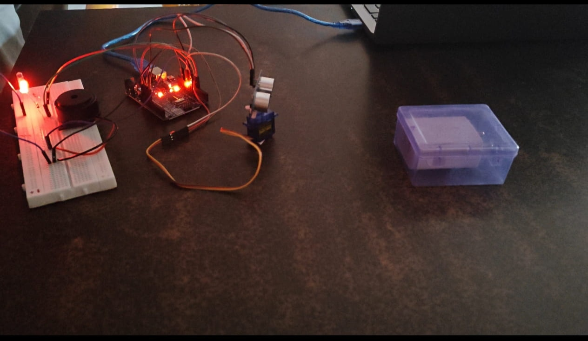
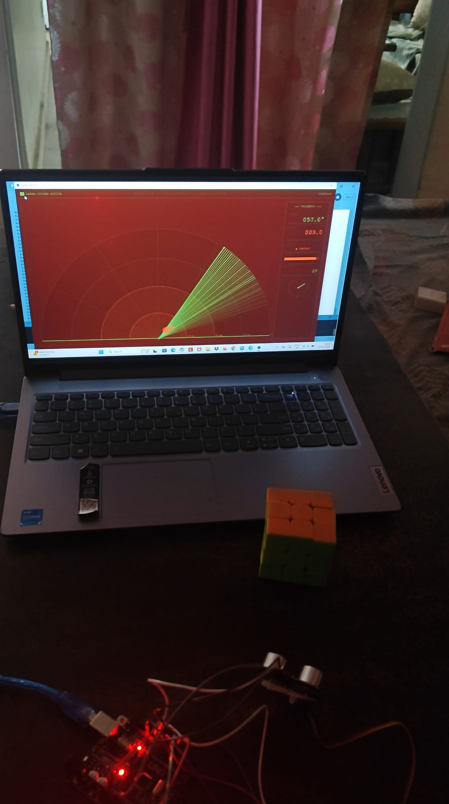

# Arduino Object Detection Radar

An Arduino-based Object Detection Radar system that uses an HC-SR04 ultrasonic sensor mounted on a servo motor to scan the surroundings and detect nearby objects. The detected object's position and distance are displayed in real time through a radar-style interface built using Processing.

## Project Preview

### Hardware Setup


### Radar Output


##Project Demo Link url - https://drive.google.com/file/d/1vDYkhH4nerfK0EbhKTUm2ArJFqTf_yxq/view?usp=drivesdk

## Features

- Real-time object detection
- Distance measurement using ultrasonic sensing
- Servo-based scanning mechanism
- Radar-style visualization using Processing
- Serial communication between Arduino and Processing

## Hardware Components

- Arduino Uno
- HC-SR04 Ultrasonic Sensor
- SG90 Servo Motor
- Breadboard
- Jumper Wires
- USB Cable

## Software Used

- Arduino IDE
- Processing

## Working

1. The servo motor rotates the ultrasonic sensor.
2. The sensor measures the distance of nearby objects.
3. Arduino sends angle and distance data through serial communication.
4. Processing receives the data and displays objects on a radar-like interface.

## Folder Structure

```text
Object-Detection-Radar/
│
├── code/
│   └── ArduinoRadar.ino
│
├── processing/
│   └── RadarDisplay.pde
│
├── images/
│   ├── setup.jpg
│   └── radar_demo.jpg
│
└── README.md
```

## Applications

- Obstacle Detection
- Robotics
- Security Systems
- Smart Navigation
- Educational Projects

## Contributors

- Anushreya Bhainsora
- Neelansh Goyal

## License

This project is intended for educational and learning purposes.
